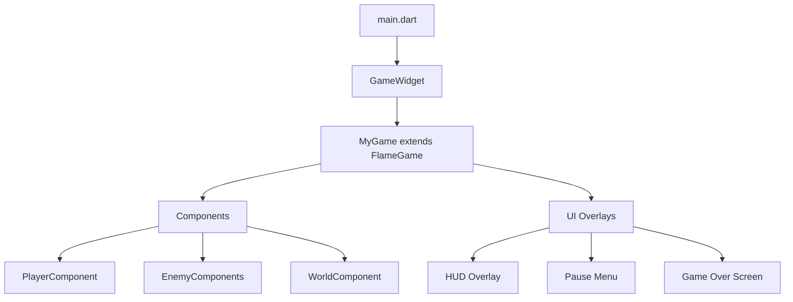

# Flutter + Flame Game Project Setup

## Project Structure

We'll create a well-organized Flutter project with the following structure:

```
game1/
├── lib/
│   ├── main.dart                 # App entry point
│   ├── game/
│   │   ├── my_game.dart          # Main FlameGame class
│   │   ├── components/           # Game components (player, enemies, etc.)
│   │   ├── overlays/             # UI overlays (pause menu, HUD, game over)
│   │   └── utils/                # Helper functions, constants
│   └── config/
│       └── game_config.dart      # Game configuration constants
├── assets/
│   ├── images/                   # Sprites, backgrounds
│   └── audio/                    # Sound effects, music
├── test/                         # Unit and widget tests
├── pubspec.yaml                  # Dependencies
└── README.md                     # Project documentation
```

## Dependencies

Core packages to add in `pubspec.yaml`:

```yaml
dependencies:
  flutter:
    sdk: flutter
  flame: ^1.18.0              # Core game engine
  flame_audio: ^2.10.0        # Audio support
  
dev_dependencies:
  flutter_test:
    sdk: flutter
  flutter_lints: ^4.0.0       # Linting
```

## Implementation Steps

### 1. Create Flutter Project

- Run `flutter create` with proper organization name
- Configure for all platforms (iOS, Android, Web, macOS, Windows, Linux)

### 2. Add Flame Dependencies

- Add `flame` and `flame_audio` packages
- Run `flutter pub get`

### 3. Set Up Project Structure

- Create the `lib/game/` directory structure
- Create the `assets/` directories for images and audio

### 4. Configure Assets

- Register asset directories in `pubspec.yaml`
- Add placeholder README files in asset folders

### 5. Create Base Game Class

- Create `MyGame` extending `FlameGame`
- Set up game loop with `onLoad`, `update`, and `render`
- Configure viewport and camera

### 6. Set Up Main Entry Point

- Wrap game in `GameWidget`
- Configure overlays for UI elements
- Handle platform-specific initialization

### 7. Create Basic Component Structure

- Add a sample player component
- Demonstrate component lifecycle

### 8. Configure Platform Settings

- Set up proper window sizes for desktop
- Configure web index.html for canvas rendering
- Set iOS/Android permissions if needed

## Architecture Overview



## Best Practices Included

- **Separation of concerns**: Game logic separate from UI overlays
- **Component-based architecture**: Using Flame's component system
- **Asset organization**: Structured folders for images and audio
- **Configuration management**: Centralized game constants
- **Cross-platform ready**: Configured for mobile, web, and desktop